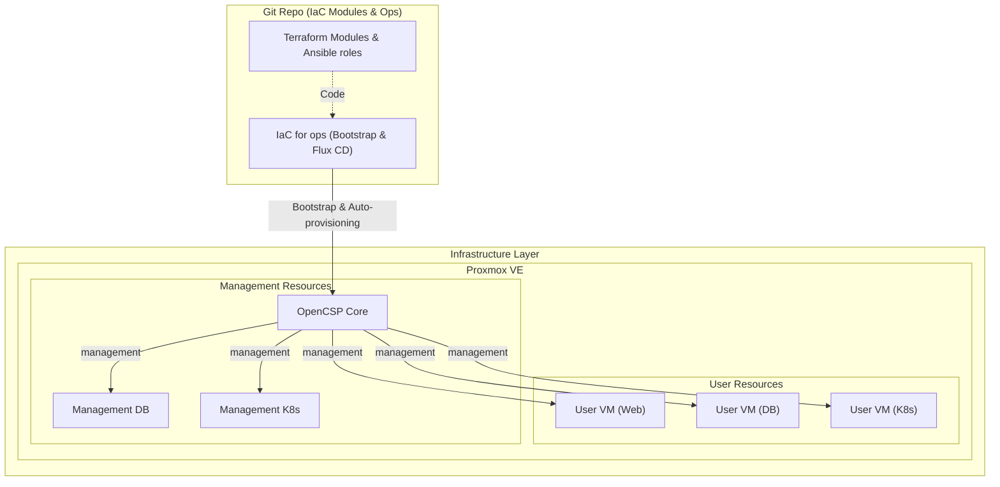
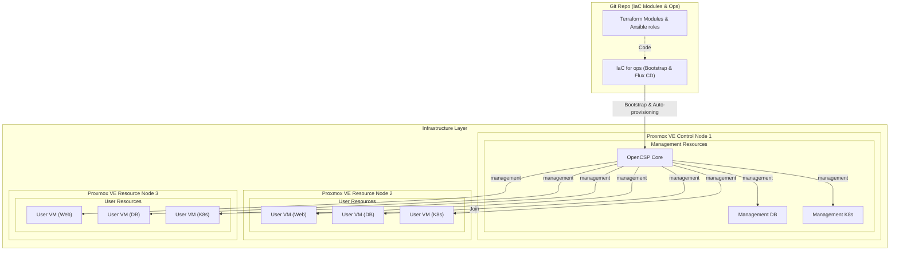
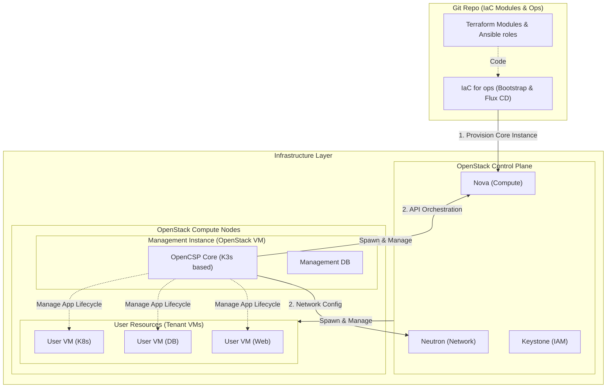
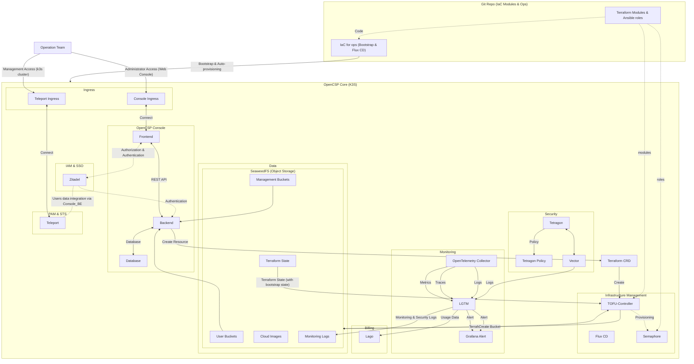
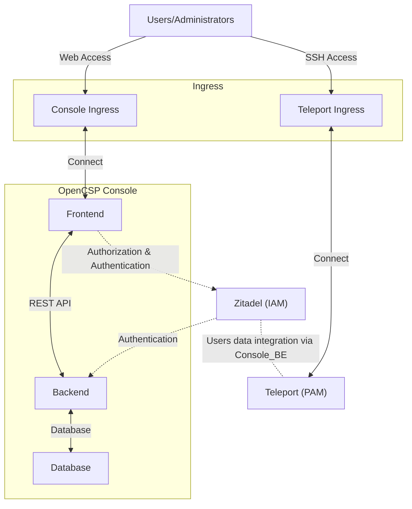

## OpenCSP Overall Architecture

```mermaid
%% OpenCSP Overall Architecture
flowchart TD
    OpsTeam["Operation Team"]
    User["Users/Administrators"]
    
    subgraph GitRepo["Git Repo (IaC Modules & Ops)"]
        GitRepo_modules["Terraform Modules & Ansible roles"]
        GitRepo_ops["IaC for ops (Bootstrap & Flux CD)"]
        GitRepo_console["OpenCSP Console Project"]
        ghcr["ghcr.io"]

        GitRepo_console -->|Image| ghcr
        ghcr -.-> |Image| GitRepo_ops
        GitRepo_modules -.-> |Code| GitRepo_ops
    end

    %% OpenCSP Core (Control Plane?)
    subgraph OpenCSP_Core ["OpenCSP Core (K3S)"]
        %% direction TB
        subgraph OpenCSP_Console ["OpenCSP Console"]
            Console_FE["Frontend"]
            Console_BE["Backend"]
            Console_DB["Database"]

            Console_FE <-->|REST API| Console_BE
            Console_BE <-->|Database| Console_DB
        end

        subgraph Infrastructure_Management ["Infrastructure Management"]
            Flux["Flux CD"]
            TF_Con["TOFU-Controller"]
            Semaphore["Semaphore"]
        end

        subgraph Monitoring ["Monitoring"]
            LGTM["LGTM"]
            AlertManager["Grafana Alert"]
            OtelCollector["OpenTelemetry Collector"]

            LGTM -->|Alert| AlertManager
            OtelCollector -->|Metrics| LGTM
            OtelCollector -->|Traces| LGTM 
            OtelCollector -->|Logs| LGTM
        end

        subgraph Billing ["Billing"]
            Lago["Lago"]
        end
        
        subgraph Data ["Data"]
            subgraph ObjectStorage["SeaweedFS (Object Storage)"]
                UserBuckets["User Buckets"]
                ManagementBuckets["Management Buckets"]
                TerraformState["Terraform State"]
                CloudImages["Cloud Images"]
                MonitoringLogs["Monitoring Logs"]
            end
        end

        %% Single Source of Truth
        subgraph IAM ["IAM & SSO"]
            Zitadel["Zitadel"]            
        end

        subgraph Security ["Security"]
            Tetragon["Tetragon"]
            %% CiliumPolicy["Cilium Policy"]
            TetragonPolicy["Tetragon Policy"]
            Vector["Vector"]

            Tetragon -->|Policy| TetragonPolicy
            Tetragon <--> Vector
        end

        subgraph PAM_and_STS ["PAM & STS"]
            Teleport["Teleport"] 
        end

        subgraph Ingress ["Ingress"]
            TeleportIngress["Teleport Ingress"]
            ConsoleIngress["Console Ingress"]

            TeleportIngress <-->|Connect| Teleport
            ConsoleIngress <-->|Connect| Console_FE
        end
        
        TerraformCRD["Terraform CRD"]
        TerraformCRD -->|Create| TF_Con

        TF_Con <-->|Terraform State| ObjectStorage
        TF_Con -->|Create Bucket| ObjectStorage

        Vector -->|Logs| LGTM
        LGTM -->|Usage Data| Lago
        LGTM -->|Alert| AlertManager

        Console_FE <-.->|Authorization & Authentication| Zitadel
        Zitadel -.->|Authentication| Console_BE
        Zitadel -.-|Users data integration via Console_BE| Teleport
        
        %% Resource Provisioning Flow
        %% User -->|"[Provisioning] 1. Create Resource"| Console_BE
        Console_BE -->|"Create Resource"| TerraformCRD
        %% TF_Con -->|"[Provisioning] 3. Update Job Status"| Console_BE
        %% Console_BE -->|"[Provisioning] 4. Start Job"| Semaphore
        %% Semaphore -->|"[Provisioning] 5. Update Job Status"| Console_BE
        %% Console_BE -->|"[Provisioning] 6. Update Job Status"| Console_DB
        TF_Con -.->|"Provisioning"| Semaphore
        GitRepo_modules -.->|"modules"| TF_Con
        GitRepo_modules -.->|"roles"| Semaphore

        %% Data Flow
        LGTM -->|"Monitoring & Security Logs"| MonitoringLogs
        UserBuckets --> Console_BE
        ManagementBuckets --> Console_BE
        TerraformState -->|"Terraform State (with bootstrap state)"| TF_Con
    end

    %% Infrastructure Layer
    subgraph Infrastructure ["Infrastructure Layer"]
        direction TB

        subgraph Proxmox["Proxmox VE Cluster (or OpenStack)"]
            subgraph UserResources["User Resources"]
                UserResources_VM1["User VM (Web)"]
                UserResources_VM2["User VM (DB)"]
                UserResources_VM3["User VM (K8s)"]
            end

            subgraph ManagementResources["Management Resources"]
                ManagementResources_VM1["Management VM (DB)"]
                ManagementResources_VM2["Management VM (K8s)"]
            end
        end
    end

    CloudImages -->|"Template Images"| Proxmox
    %% GitOps Flow
    GitRepo -->|Sync| Flux
    %% Flux -->|Reconcile| TF_Con
    
    %% Provisioning Flow
    TF_Con -->|API Call| Proxmox
    Infrastructure_Management -.->|Terraform/Ansible| UserResources_VM1
    Infrastructure_Management -.->|Terraform/Ansible| UserResources_VM2
    Infrastructure_Management -.->|Terraform/Ansible| UserResources_VM3
    Infrastructure_Management -.->|Terraform/Ansible| ManagementResources_VM1
    Infrastructure_Management -.->|Terraform/Ansible| ManagementResources_VM2
    
    %% Monitoring Flow
    Proxmox -.->|Metrics| OtelCollector

    UserResources_VM1 -.->|Logs/Metrics| OtelCollector
    UserResources_VM2 -.->|Logs/Metrics| OtelCollector
    UserResources_VM3 -.->|Logs/Metrics| OtelCollector
    
    %% PAM Flow
    Teleport -.->|Connect| UserResources_VM1
    Teleport -.->|Connect| UserResources_VM2
    Teleport -.->|Connect| UserResources_VM3
    Teleport -.->|Connect| ManagementResources_VM1
    Teleport -.->|Connect| ManagementResources_VM2

    User -->|"Console Access (Web)"| ConsoleIngress
    User -->|"Resource Access (SSH)"| TeleportIngress
    OpsTeam -->|"Management Access (Ops cluster)"| TeleportIngress

    %% Styling
    %% style OpenCSP_Console fill:#121212,stroke:#333,stroke-width:2px
    %% style Proxmox fill:#232323,stroke:#333,stroke-width:2px
    %% style Flux fill:#323232,stroke:#333,stroke-width:2px
    %% style Lago fill:#323232,stroke:#333,stroke-width:2px
    %% style LGTM fill:#323232,stroke:#333,stroke-width:2px
```

## Infrastructure Layer Architecture
- Proxmox VE (Standalone)

- Proxmox VE Cluster (Multi-node)

- OpenStack (planned)

## Core Architecture
- OpenCSP Core

## Console Architecture
