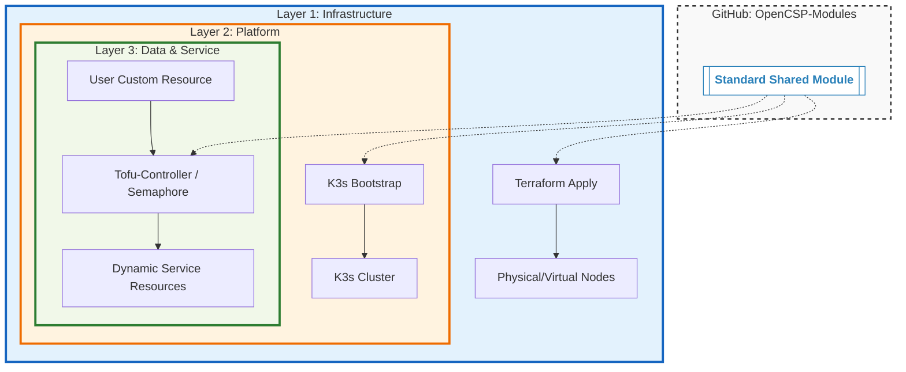

```mermaid
graph TD
    %% 외부 공유 모듈 (DNA)
    subgraph GitHub_Repo [GitHub: OpenCSP-Modules]
        M[[Standard Shared Module]]
        style GitHub_Repo fill:#f9f9f9,stroke:#333,stroke-width:2px,stroke-dasharray: 5 5
    end

    subgraph Layer1 [Layer 1: Infrastructure]
        direction TB
        L1_Apply[Terraform Apply] --> L1_Nodes[Physical/Virtual Nodes]
        
        subgraph Layer2 [Layer 2: Platform]
            direction TB
            L2_Boot[K3s Bootstrap] --> L2_Cluster[K3s Cluster]
            
            subgraph Layer3 [Layer 3: Data & Service]
                direction TB
                L3_CR[User Custom Resource] --> L3_Controller[Tofu-Controller / Semaphore]
                L3_Controller --> L3_App[Dynamic Service Resources]
            end
        end
    end

    %% 공유 모듈 호출 관계 (프랙탈 주입)
    M -.-> L1_Apply
    M -.-> L2_Boot
    M -.-> L3_Controller

    %% 스타일링
    style Layer1 fill:#e3f2fd,stroke:#1565c0,stroke-width:3px
    style Layer2 fill:#fff3e0,stroke:#ef6c00,stroke-width:3px
    style Layer3 fill:#f1f8e9,stroke:#2e7d32,stroke-width:3px
    style M fill:#ffffff,stroke:#2980b9,font-weight:bold,color:#2980b9
```