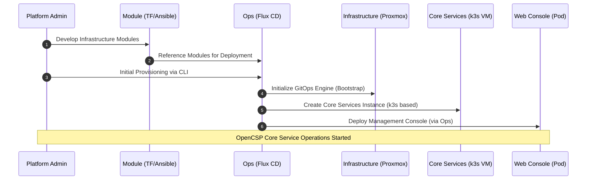
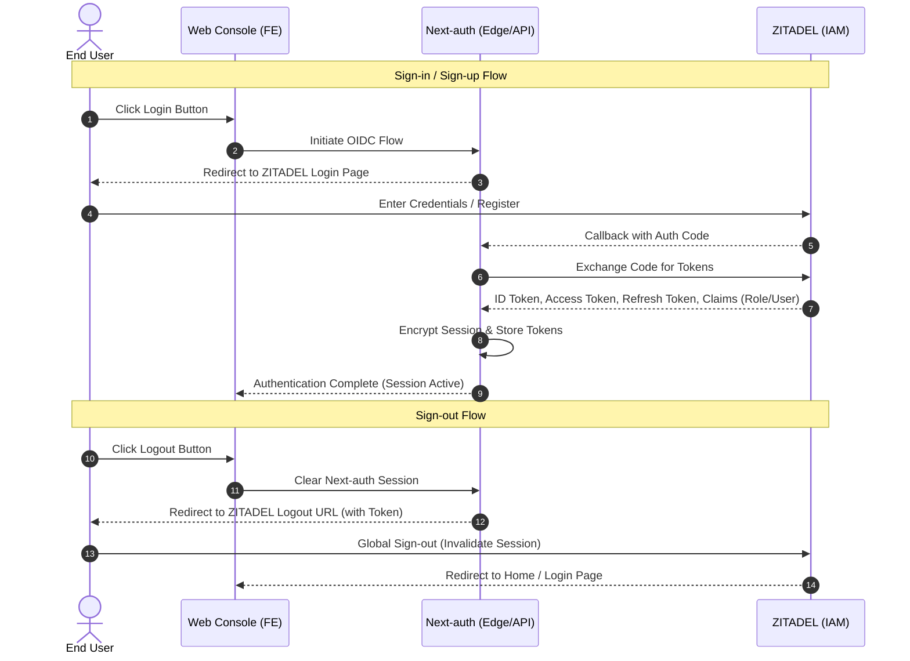
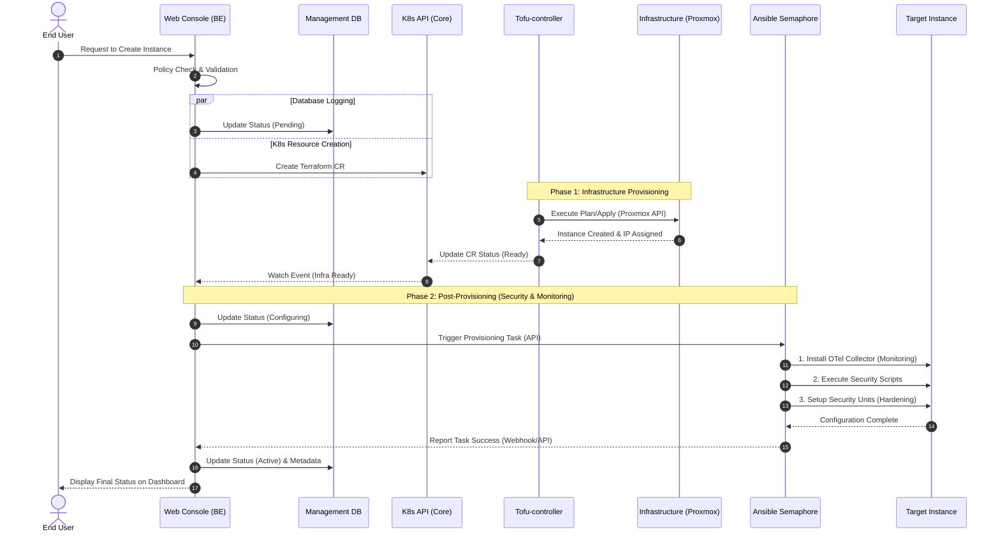
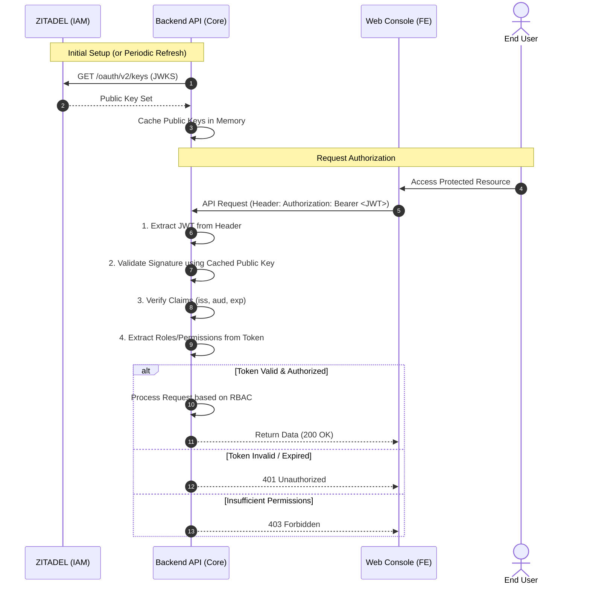

### Bootstrap Flow

```mermaid
sequenceDiagram
    autonumber
    participant Admin as Platform Admin
    participant Mod as Module (TF/Ansible)
    participant Ops as Ops (Flux CD)
    participant Infra as Infrastructure (Proxmox)
    participant Core as Core Services (k3s VM)
    participant Console as Web Console (Pod)

    Admin->>Mod: Develop Infrastructure Modules
    Mod->>Ops: Reference Modules for Deployment
    Admin->>Ops: Initial Provisioning via CLI
    Ops->>Infra: Initialize GitOps Engine (Bootstrap)
    Ops->>Core: Create Core Services Instance (k3s based)
    Ops->>Console: Deploy Management Console (via Ops)
    
    Note over Admin, Console: OpenCSP Core Service Operations Started
```

### User Flow

- Auth : Sign-up / Sign-in / Sign-out

```mermaid
sequenceDiagram
    autonumber
    actor User as End User
    participant FE as Web Console (FE)
    participant Auth as Next-auth (Edge/API)
    participant Zitadel as ZITADEL (IAM)

    %% Sign-in / Sign-up Flow
    Note over User, Zitadel: Sign-in / Sign-up Flow
    User->>FE: Click Login Button
    FE->>Auth: Initiate OIDC Flow
    Auth-->>User: Redirect to ZITADEL Login Page
    
    User->>Zitadel: Enter Credentials / Register
    Zitadel-->>Auth: Callback with Auth Code
    
    Auth->>Zitadel: Exchange Code for Tokens
    Zitadel-->>Auth: ID Token, Access Token, Refresh Token, Claims (Role/User)
    
    Auth->>Auth: Encrypt Session & Store Tokens
    Auth-->>FE: Authentication Complete (Session Active)

    %% Sign-out Flow
    Note over User, Zitadel: Sign-out Flow
    User->>FE: Click Logout Button
    FE->>Auth: Clear Next-auth Session
    Auth-->>User: Redirect to ZITADEL Logout URL (with Token)
    User->>Zitadel: Global Sign-out (Invalidate Session)
    Zitadel-->>FE: Redirect to Home / Login Page
```

- Instance Management

```mermaid
sequenceDiagram
    autonumber
    actor User as End User
    participant Console as Web Console (BE)
    participant DB as Management DB
    participant K8s as K8s API (Core)
    participant Tofu as Tofu-controller
    participant Infra as Infrastructure (Proxmox)
    participant Sem as Ansible Semaphore
    participant VM as Target Instance

    User->>Console: Request to Create Instance
    Console->>Console: Policy Check & Validation
    
    par Database Logging
        Console->>DB: Update Status (Pending)
    and K8s Resource Creation
        Console->>K8s: Create Terraform CR
    end

    %% Phase 1: Infrastructure Provisioning
    Note over Tofu, Infra: Phase 1: Infrastructure Provisioning
    Tofu->>Infra: Execute Plan/Apply (Proxmox API)
    Infra-->>Tofu: Instance Created & IP Assigned
    Tofu-->>K8s: Update CR Status (Ready)
    K8s-->>Console: Watch Event (Infra Ready)

    %% Phase 2: Post-Provisioning (Configuration Management)
    Note over Console, Sem: Phase 2: Post-Provisioning (Security & Monitoring)
    Console->>DB: Update Status (Configuring)
    Console->>Sem: Trigger Provisioning Task (API)
    
    Sem->>VM: 1. Install OTel Collector (Monitoring)
    Sem->>VM: 2. Execute Security Scripts
    Sem->>VM: 3. Setup Security Units (Hardening)
    VM-->>Sem: Configuration Complete
    
    Sem-->>Console: Report Task Success (Webhook/API)
    
    %% Finalization
    Console->>DB: Update Status (Active) & Metadata
    Console-->>User: Display Final Status on Dashboard
```

### API Authorization Flow

```mermaid
sequenceDiagram
    autonumber
    participant Zitadel as ZITADEL (IAM)
    participant BE as Backend API (Core)
    participant FE as Web Console (FE)
    actor User as End User

    Note over Zitadel, BE: Initial Setup (or Periodic Refresh)
    BE->>Zitadel: GET /oauth/v2/keys (JWKS)
    Zitadel-->>BE: Public Key Set
    BE->>BE: Cache Public Keys in Memory

    Note over User, BE: Request Authorization
    User->>FE: Access Protected Resource
    FE->>BE: API Request (Header: Authorization: Bearer <JWT>)
    
    BE->>BE: 1. Extract JWT from Header
    BE->>BE: 2. Validate Signature using Cached Public Key
    BE->>BE: 3. Verify Claims (iss, aud, exp)
    BE->>BE: 4. Extract Roles/Permissions from Token

    alt Token Valid & Authorized
        BE->>BE: Process Request based on RBAC
        BE-->>FE: Return Data (200 OK)
    else Token Invalid / Expired
        BE-->>FE: 401 Unauthorized
    else Insufficient Permissions
        BE-->>FE: 403 Forbidden
    end
```
