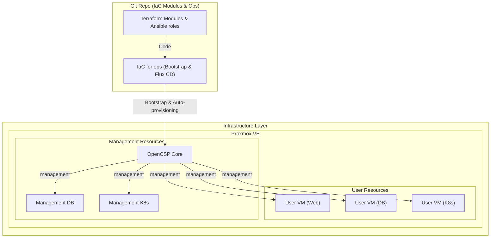
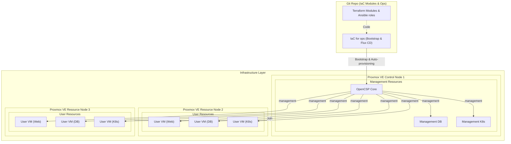
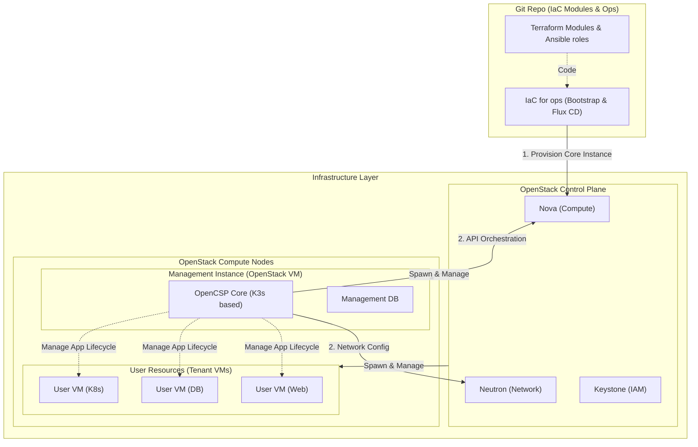

## Infrastructure Layer Architecture
- Proxmox VE (Standalone)

```mermaid
flowchart TD
    %% GitOps Flow
    subgraph GitRepo["Git Repo (IaC Modules & Ops)"]
        GitRepo_modules["Terraform Modules & Ansible roles"]
        GitRepo_ops["IaC for ops (Bootstrap & Flux CD)"]
        
        GitRepo_modules -.-> |Code| GitRepo_ops
    end

    %% Infrastructure Layer
    subgraph Infrastructure ["Infrastructure Layer"]
        direction LR

        subgraph Proxmox["Proxmox VE"]
            subgraph UserResources["User Resources"]
                UserResources_VM1["User VM (Web)"]
                UserResources_VM2["User VM (DB)"]
                UserResources_VM3["User VM (K8s)"]
            end

            subgraph ManagementResources["Management Resources"]
                ManagementResources_Core["OpenCSP Core"]
                ManagementResources_DB["Management DB"]
                ManagementResources_K8s["Management K8s"]
            end
        end

        ManagementResources_Core --> |"management"| ManagementResources_K8s
        ManagementResources_Core --> |"management"| ManagementResources_DB
        ManagementResources_Core --> |"management"| UserResources_VM1
        ManagementResources_Core --> |"management"| UserResources_VM2
        ManagementResources_Core --> |"management"| UserResources_VM3
    end

    GitRepo_ops --> |"Bootstrap & Auto-provisioning"| ManagementResources_Core
```

- Proxmox VE Cluster (Multi-node)

```mermaid
flowchart TD
    %% GitOps Flow
    subgraph GitRepo["Git Repo (IaC Modules & Ops)"]
        GitRepo_modules["Terraform Modules & Ansible roles"]
        GitRepo_ops["IaC for ops (Bootstrap & Flux CD)"]
        
        GitRepo_modules -.-> |Code| GitRepo_ops
    end

    %% Infrastructure Layer
    subgraph Infrastructure ["Infrastructure Layer"]
        subgraph Proxmox_ControlNode_1["Proxmox VE Control Node 1"]
            subgraph ManagementResources["Management Resources"]
                ManagementResources_Core["OpenCSP Core"]
                ManagementResources_DB["Management DB"]
                ManagementResources_K8s["Management K8s"]
            end
        end

        subgraph Proxmox_ResourceNode_1["Proxmox VE Resource Node 2"]
            subgraph Node1_UserResources["User Resources"]
                Node1_UserResources_VM1["User VM (Web)"]
                Node1_UserResources_VM2["User VM (DB)"]
                Node1_UserResources_VM3["User VM (K8s)"]
            end
        end

        subgraph Proxmox_ResourceNode_2["Proxmox VE Resource Node 3"]
            subgraph Node2_UserResources["User Resources"]
                Node2_UserResources_VM1["User VM (Web)"]
                Node2_UserResources_VM2["User VM (DB)"]
                Node2_UserResources_VM3["User VM (K8s)"]
            end
        end

        Proxmox_ResourceNode_2 -->|Join| Proxmox_ControlNode_1
        Proxmox_ResourceNode_1 -->|Join| Proxmox_ControlNode_1

        ManagementResources_Core --> |"management"| ManagementResources_K8s
        ManagementResources_Core --> |"management"| ManagementResources_DB
        ManagementResources_Core --> |"management"| Node1_UserResources_VM1
        ManagementResources_Core --> |"management"| Node1_UserResources_VM2
        ManagementResources_Core --> |"management"| Node1_UserResources_VM3
        ManagementResources_Core --> |"management"| Node2_UserResources_VM1
        ManagementResources_Core --> |"management"| Node2_UserResources_VM2
        ManagementResources_Core --> |"management"| Node2_UserResources_VM3
    end

    GitRepo_ops --> |"Bootstrap & Auto-provisioning"| ManagementResources_Core
```

- OpenStack (planned)

```mermaid
flowchart TD
    %% GitOps Flow
    subgraph GitRepo["Git Repo (IaC Modules & Ops)"]
        GitRepo_modules["Terraform Modules & Ansible roles"]
        GitRepo_ops["IaC for ops (Bootstrap & Flux CD)"]
        
        GitRepo_modules -.-> |Code| GitRepo_ops
    end

    %% Infrastructure Layer
    subgraph Infrastructure ["Infrastructure Layer"]
        direction TB
        
        %% Control Plane
        subgraph OS_Control["OpenStack Control Plane"]
            OS_Nova["Nova (Compute)"]
            OS_Neutron["Neutron (Network)"]
            OS_Keystone["Keystone (IAM)"]
        end

        %% Compute Nodes & Instances
        subgraph OS_Compute_Nodes["OpenStack Compute Nodes"]
            
            %% Management Instance (The Core)
            subgraph Mgmt_Instance["Management Instance (OpenStack VM)"]
                Core["OpenCSP Core (K3s based)"]
                Core_DB["Management DB"]
            end

            %% User Instances managed by Core
            subgraph User_Instances["User Resources (Tenant VMs)"]
                User_VM_Web["User VM (Web)"]
                User_VM_DB["User VM (DB)"]
                User_VM_K8s["User VM (K8s)"]
            end
        end

        OS_Control --> |"Spawn & Manage"| Mgmt_Instance
        OS_Control --> |"Spawn & Manage"| User_Instances
    end

    %% Provisioning Flows
    GitRepo_ops --> |"1. Provision Core Instance"| OS_Nova
    
    %% Core's Management Flow
    Core --> |"2. API Orchestration"| OS_Nova
    Core --> |"2. Network Config"| OS_Neutron
    
    %% Direct Management Logic
    Core -.-> |"Manage App Lifecycle"| User_VM_Web
    Core -.-> |"Manage App Lifecycle"| User_VM_DB
    Core -.-> |"Manage App Lifecycle"| User_VM_K8s
```

- KVM

- Public Clouds