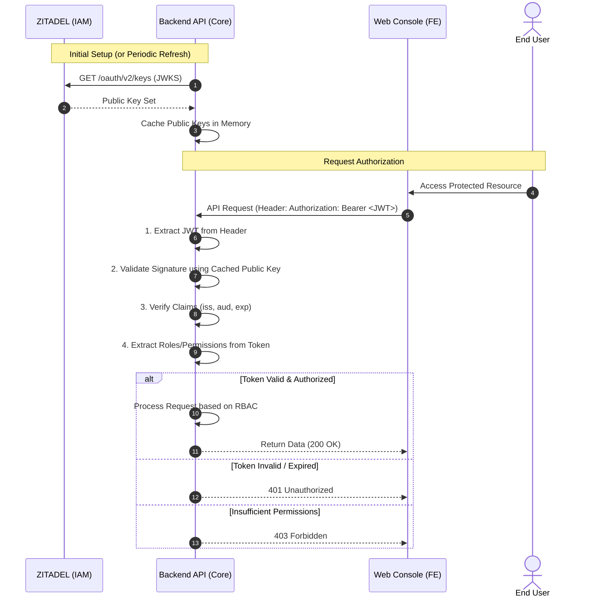

### API Authorization Flow

```mermaid
sequenceDiagram
    autonumber
    participant Zitadel as ZITADEL (IAM)
    participant BE as Backend API (Core)
    participant FE as Web Console (FE)
    actor User as End User

    Note over Zitadel, BE: Initial Setup (or Periodic Refresh)
    BE->>Zitadel: GET /oauth/v2/keys (JWKS)
    Zitadel-->>BE: Public Key Set
    BE->>BE: Cache Public Keys in Memory

    Note over User, BE: Request Authorization
    User->>FE: Access Protected Resource
    FE->>BE: API Request (Header: Authorization: Bearer <JWT>)
    
    BE->>BE: 1. Extract JWT from Header
    BE->>BE: 2. Validate Signature using Cached Public Key
    BE->>BE: 3. Verify Claims (iss, aud, exp)
    BE->>BE: 4. Extract Roles/Permissions from Token

    alt Token Valid & Authorized
        BE->>BE: Process Request based on RBAC
        BE-->>FE: Return Data (200 OK)
    else Token Invalid / Expired
        BE-->>FE: 401 Unauthorized
    else Insufficient Permissions
        BE-->>FE: 403 Forbidden
    end
```
