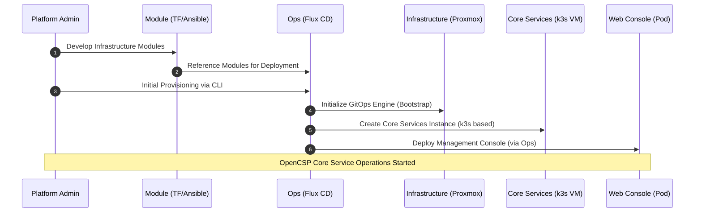

### Bootstrap Flow

```mermaid
sequenceDiagram
    autonumber
    participant Admin as Platform Admin
    participant Mod as Module (TF/Ansible)
    participant Ops as Ops (Flux CD)
    participant Infra as Infrastructure (Proxmox)
    participant Core as Core Services (k3s VM)
    participant Console as Web Console (Pod)

    Admin->>Mod: Develop Infrastructure Modules
    Mod->>Ops: Reference Modules for Deployment
    Admin->>Ops: Initial Provisioning via CLI
    Ops->>Infra: Initialize GitOps Engine (Bootstrap)
    Ops->>Core: Create Core Services Instance (k3s based)
    Ops->>Console: Deploy Management Console (via Ops)
    
    Note over Admin, Console: OpenCSP Core Service Operations Started
```

### FluxCD
