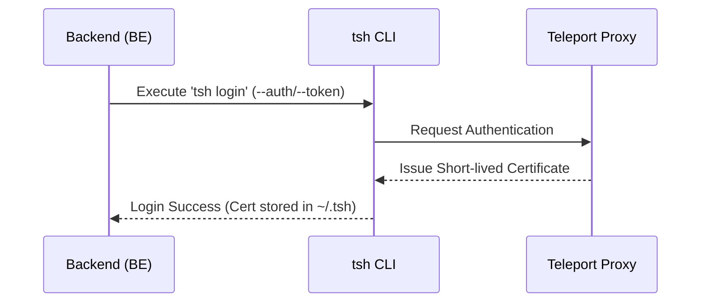
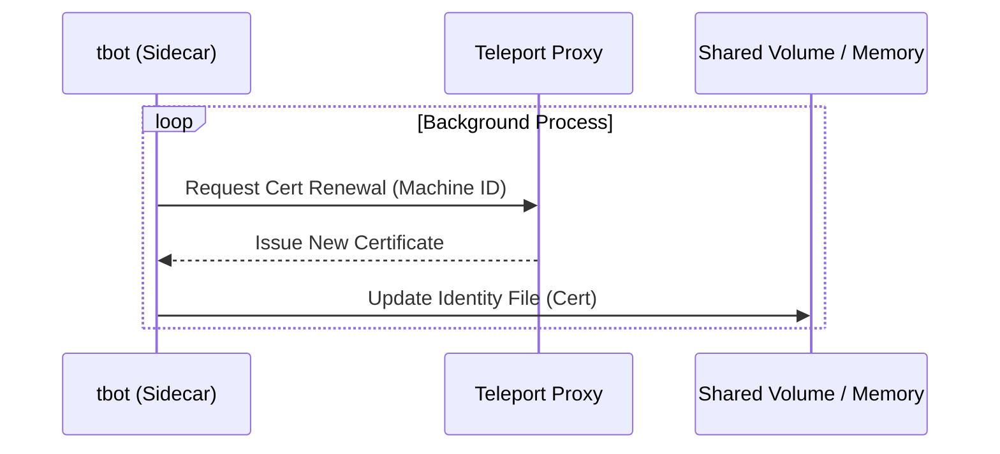
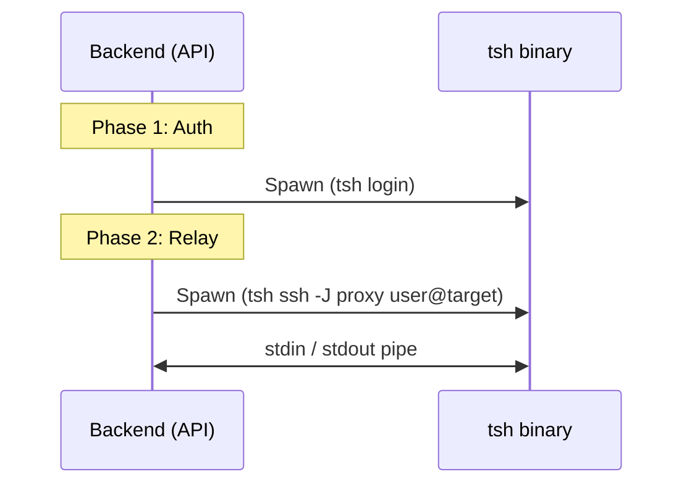
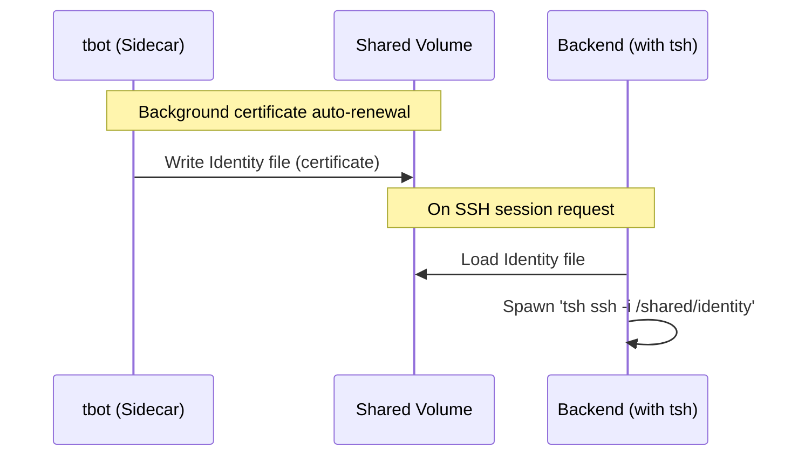
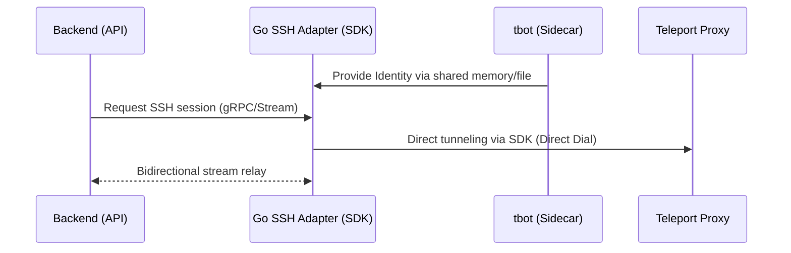

# Teleport Authentication & SSH Relay Flows

This document defines the various approaches used within the infrastructure layer to relay and authenticate SSH sessions via **Teleport**.

---

## 1. Authentication Methods

### A. Direct Login (`tsh login`)

The service authenticates directly to the Teleport Proxy using credentials (e.g., a token) and receives a short-lived certificate.

- **Characteristics:** Simple to implement; well-suited for CLI environments.
- **Note:** The application must manage re-authentication logic when a session expires.

### B. Machine ID (`tbot` Sidecar)

`tbot` is deployed as a sidecar to automate certificate issuance and renewal.

- **Characteristics:** Certificate renewal runs automatically in the background.
- **Advantage:** Authentication logic is decoupled from the application, improving security and operational simplicity.

---

## 2. Connection Methods

### Direct Pipe Relay (`tsh` stdin/stdout)

SSH sessions are relayed by piping stdin and stdout directly to a `tsh ssh` process. WebSocket data streams from the frontend are mapped to the process's I/O to enable interactive terminal sessions.

- **Data flow:** `FE (WS) <-> BE <-> tsh ssh <-> Teleport Proxy <-> Target Instance`

---

## 3. Implementation Options

### Option 1. BE-tsh (MVP / PoC)

> **"Direct Control"** — for feature validation and early development

Both authentication (`tsh login`) and connection (`tsh ssh`) are handled by the Backend by spawning processes directly.

- **Advantage:** No additional components; architecture is straightforward.
- **Disadvantage:** High dependency on OS processes; risk of `~/.tsh` credential conflicts in multi-user environments.

---

### Option 2. Pod (BE/tsh + tbot Sidecar)

> **"Auth-Decoupled"** — for cloud-native production environments

Certificate management is delegated entirely to a `tbot` sidecar; `tsh` only handles the connection by reading the generated identity file.

- **Structure:** Within the same Pod, `Container(BE + tsh)` and `Container(tbot)` share a Shared Volume.
- **Advantage:** Authentication is automated and renewal is handled transparently by `tbot`.
- **Disadvantage:** Still incurs the overhead of fork/exec for the `tsh` binary.

---

### Option 3. BE ↔ Go Adapter Pod (Enterprise)

> **"SDK-based Integrated Control"** — for high performance and scalability

A dedicated SSH adapter using the Teleport Go SDK is developed and deployed as a standalone service.

- **Structure:** `Backend` ↔ `Go Adapter (SDK + tbot)`.
- **Advantage:** Eliminates process-forking overhead (native Go streams); enables fine-grained session control and security policy enforcement via the SDK.
- **Disadvantage:** Requires building and maintaining a new Go-based adapter service.

---

## Summary & Comparison

| | Option 1 (BE-tsh) | Option 2 (Pod + tbot) | Option 3 (Go SDK Adapter) |
| :--- | :--- | :--- | :--- |
| **Best for** | Initial MVP, local testing | General production environments | High-performance, large-scale session management |
| **Auth management** | Managed directly by BE | Automated via tbot sidecar | Handled internally by tbot + SDK |
| **Connection method** | tsh binary pipe | tsh binary pipe | Go SDK native stream |
| **Security** | Low (credential handling is fragile) | High (auto-renewal) | Highest (session-level control) |
| **Scalability** | Low (high resource consumption) | Medium | High (lightweight streams) |
