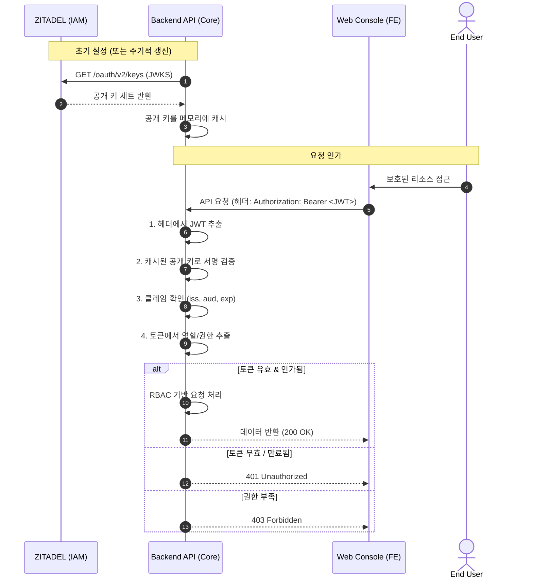

### API 인가 플로우

```mermaid
sequenceDiagram
    autonumber
    participant Zitadel as ZITADEL (IAM)
    participant BE as Backend API (Core)
    participant FE as Web Console (FE)
    actor User as End User

    Note over Zitadel, BE: 초기 설정 (또는 주기적 갱신)
    BE->>Zitadel: GET /oauth/v2/keys (JWKS)
    Zitadel-->>BE: 공개 키 세트 반환
    BE->>BE: 공개 키를 메모리에 캐시

    Note over User, BE: 요청 인가
    User->>FE: 보호된 리소스 접근
    FE->>BE: API 요청 (헤더: Authorization: Bearer <JWT>)
    
    BE->>BE: 1. 헤더에서 JWT 추출
    BE->>BE: 2. 캐시된 공개 키로 서명 검증
    BE->>BE: 3. 클레임 확인 (iss, aud, exp)
    BE->>BE: 4. 토큰에서 역할/권한 추출

    alt 토큰 유효 & 인가됨
        BE->>BE: RBAC 기반 요청 처리
        BE-->>FE: 데이터 반환 (200 OK)
    else 토큰 무효 / 만료됨
        BE-->>FE: 401 Unauthorized
    else 권한 부족
        BE-->>FE: 403 Forbidden
    end
```
