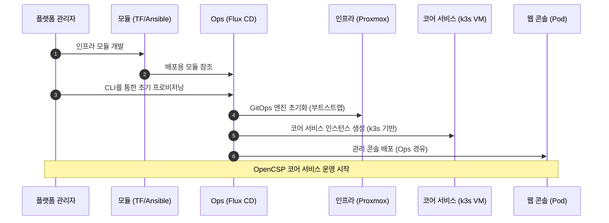

### 부트스트랩 플로우

```mermaid
sequenceDiagram
    autonumber
    participant Admin as 플랫폼 관리자
    participant Mod as 모듈 (TF/Ansible)
    participant Ops as Ops (Flux CD)
    participant Infra as 인프라 (Proxmox)
    participant Core as 코어 서비스 (k3s VM)
    participant Console as 웹 콘솔 (Pod)

    Admin->>Mod: 인프라 모듈 개발
    Mod->>Ops: 배포용 모듈 참조
    Admin->>Ops: CLI를 통한 초기 프로비저닝
    Ops->>Infra: GitOps 엔진 초기화 (부트스트랩)
    Ops->>Core: 코어 서비스 인스턴스 생성 (k3s 기반)
    Ops->>Console: 관리 콘솔 배포 (Ops 경유)
    
    Note over Admin, Console: OpenCSP 코어 서비스 운영 시작
```

### FluxCD
