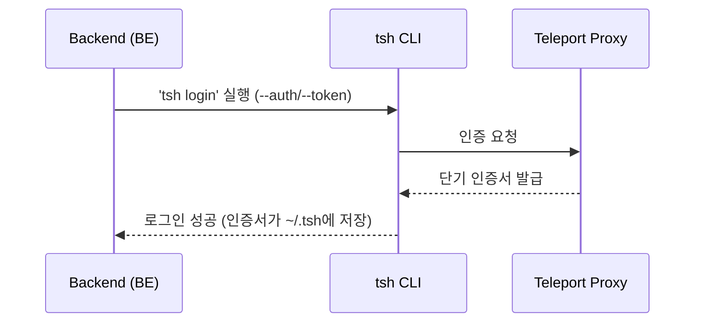
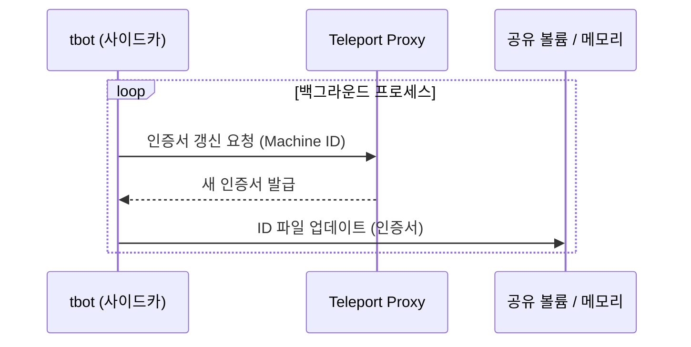
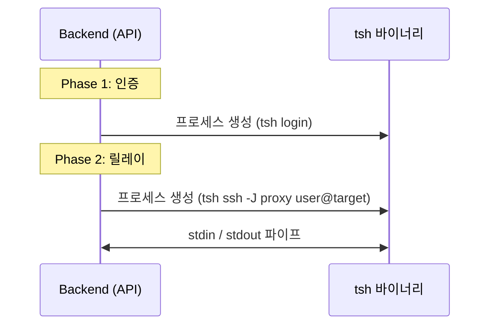
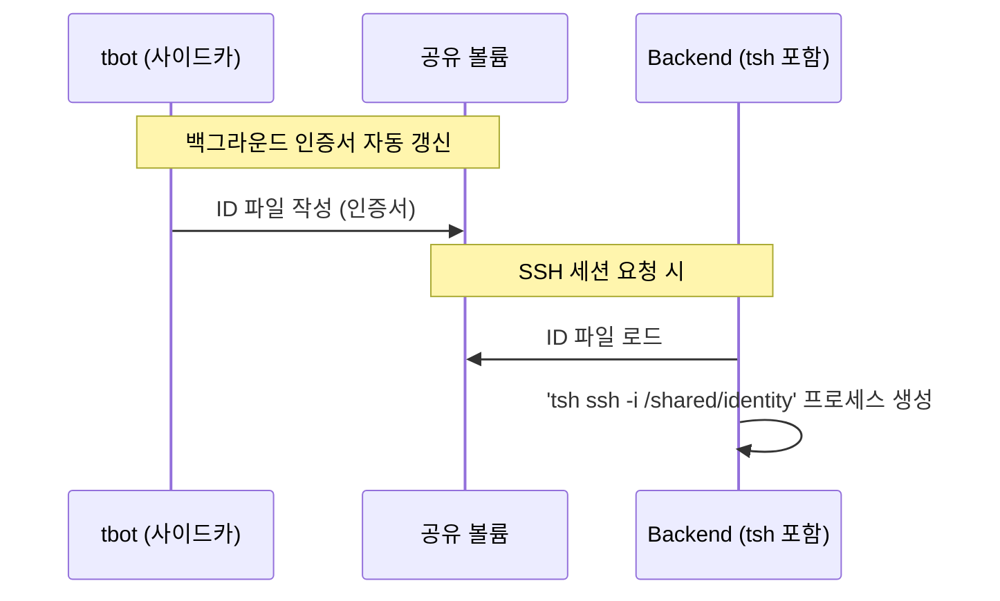
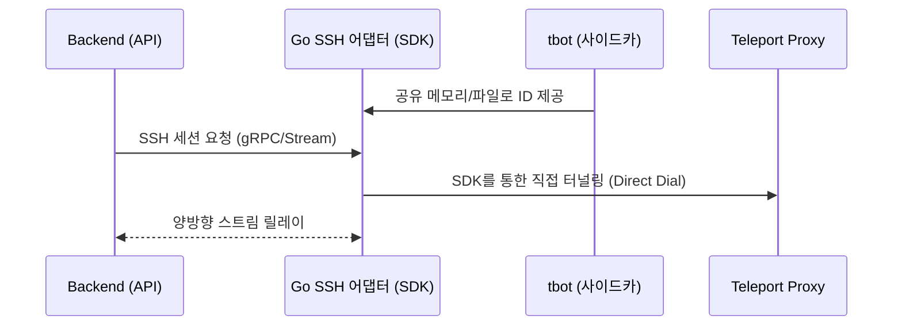

# Teleport 인증 및 SSH 릴레이 플로우

이 문서는 인프라 레이어 내에서 **Teleport**를 통해 SSH 세션을 릴레이하고 인증하는 다양한 방식을 정의합니다.

---

## 1. 인증 방식

### A. 직접 로그인 (`tsh login`)

서비스가 자격증명(예: 토큰)을 사용하여 Teleport Proxy에 직접 인증하고, 단기 인증서를 발급받습니다.

- **특징:** 구현이 간단하며 CLI 환경에 적합합니다.
- **참고:** 세션 만료 시 재인증 로직을 애플리케이션에서 직접 관리해야 합니다.

### B. Machine ID (`tbot` 사이드카)

`tbot`을 사이드카로 배포하여 인증서 발급 및 갱신을 자동화합니다.

- **특징:** 인증서 갱신이 백그라운드에서 자동으로 실행됩니다.
- **장점:** 인증 로직이 애플리케이션에서 분리되어 보안성과 운영 편의성이 향상됩니다.

---

## 2. 연결 방식

### 직접 파이프 릴레이 (`tsh` stdin/stdout)

SSH 세션을 `tsh ssh` 프로세스의 stdin/stdout을 직접 파이핑하여 릴레이합니다. 프론트엔드에서 수신한 WebSocket 데이터 스트림을 프로세스의 I/O에 매핑하여 인터랙티브 터미널 세션을 구현합니다.

- **데이터 흐름:** `FE (WS) <-> BE <-> tsh ssh <-> Teleport Proxy <-> 대상 인스턴스`

---

## 3. 구현 옵션

### 옵션 1. BE-tsh (MVP / PoC)

> **"직접 제어"** — 기능 검증 및 초기 개발 단계

인증(`tsh login`)과 연결(`tsh ssh`) 모두 Backend에서 프로세스를 직접 생성하여 처리합니다.

- **장점:** 추가 컴포넌트 없이 아키텍처가 단순합니다.
- **단점:** OS 프로세스 의존도가 높고, 멀티유저 환경에서 `~/.tsh` 자격증명 충돌 위험이 있습니다.

---

### 옵션 2. Pod (BE/tsh + tbot 사이드카)

> **"인증 분리"** — 클라우드 네이티브 프로덕션 환경

인증서 관리를 `tbot` 사이드카에 전적으로 위임하고, `tsh`는 생성된 ID 파일을 읽어 연결만 처리합니다.

- **구조:** 동일한 Pod 내에서 `Container(BE + tsh)`와 `Container(tbot)`이 공유 볼륨을 사용합니다.
- **장점:** 인증이 자동화되고 `tbot`이 투명하게 갱신을 처리합니다.
- **단점:** `tsh` 바이너리의 fork/exec 오버헤드가 여전히 발생합니다.

---

### 옵션 3. BE ↔ Go 어댑터 Pod (엔터프라이즈)

> **"SDK 기반 통합 제어"** — 고성능 및 대규모 확장 환경

Teleport Go SDK를 사용하는 전용 SSH 어댑터를 독립 서비스로 개발·배포합니다.

- **구조:** `Backend` ↔ `Go 어댑터 (SDK + tbot)`.
- **장점:** 프로세스 포킹 오버헤드 제거(네이티브 Go 스트림), SDK를 통한 세밀한 세션 제어 및 보안 정책 적용이 가능합니다.
- **단점:** 새로운 Go 기반 어댑터 서비스를 구축하고 유지보수해야 합니다.

---

## 요약 및 비교

| | 옵션 1 (BE-tsh) | 옵션 2 (Pod + tbot) | 옵션 3 (Go SDK 어댑터) |
| :--- | :--- | :--- | :--- |
| **최적 용도** | 초기 MVP, 로컬 테스트 | 일반 프로덕션 환경 | 고성능, 대규모 세션 관리 |
| **인증 관리** | BE에서 직접 관리 | tbot 사이드카로 자동화 | tbot + SDK 내부 처리 |
| **연결 방식** | tsh 바이너리 파이프 | tsh 바이너리 파이프 | Go SDK 네이티브 스트림 |
| **보안** | 낮음 (자격증명 처리 취약) | 높음 (자동 갱신) | 최고 (세션 수준 제어) |
| **확장성** | 낮음 (높은 리소스 소모) | 중간 | 높음 (경량 스트림) |
