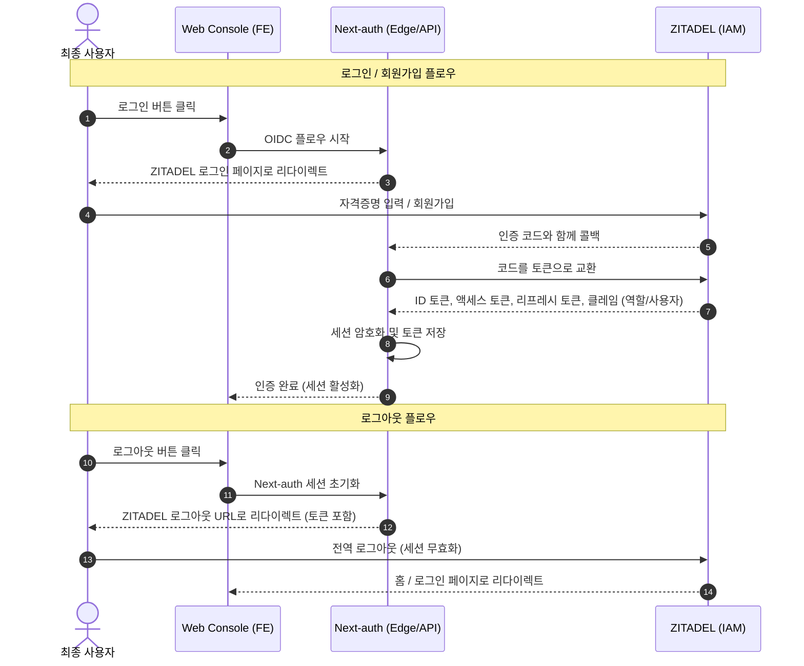
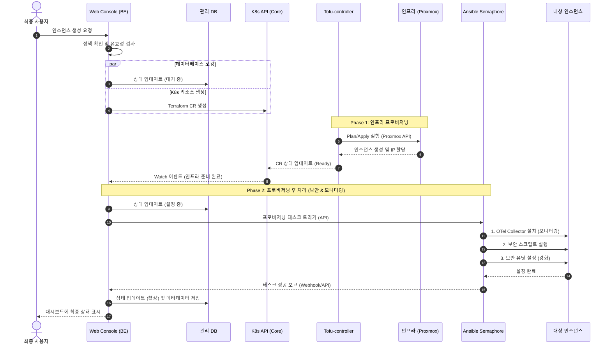

### 사용자 플로우

- 인증: 회원가입 / 로그인 / 로그아웃

```mermaid
sequenceDiagram
    autonumber
    actor User as 최종 사용자
    participant FE as Web Console (FE)
    participant Auth as Next-auth (Edge/API)
    participant Zitadel as ZITADEL (IAM)

    %% 로그인 / 회원가입 플로우
    Note over User, Zitadel: 로그인 / 회원가입 플로우
    User->>FE: 로그인 버튼 클릭
    FE->>Auth: OIDC 플로우 시작
    Auth-->>User: ZITADEL 로그인 페이지로 리다이렉트
    
    User->>Zitadel: 자격증명 입력 / 회원가입
    Zitadel-->>Auth: 인증 코드와 함께 콜백
    
    Auth->>Zitadel: 코드를 토큰으로 교환
    Zitadel-->>Auth: ID 토큰, 액세스 토큰, 리프레시 토큰, 클레임 (역할/사용자)
    
    Auth->>Auth: 세션 암호화 및 토큰 저장
    Auth-->>FE: 인증 완료 (세션 활성화)

    %% 로그아웃 플로우
    Note over User, Zitadel: 로그아웃 플로우
    User->>FE: 로그아웃 버튼 클릭
    FE->>Auth: Next-auth 세션 초기화
    Auth-->>User: ZITADEL 로그아웃 URL로 리다이렉트 (토큰 포함)
    User->>Zitadel: 전역 로그아웃 (세션 무효화)
    Zitadel-->>FE: 홈 / 로그인 페이지로 리다이렉트
```

- 인스턴스 관리

```mermaid
sequenceDiagram
    autonumber
    actor User as 최종 사용자
    participant Console as Web Console (BE)
    participant DB as 관리 DB
    participant K8s as K8s API (Core)
    participant Tofu as Tofu-controller
    participant Infra as 인프라 (Proxmox)
    participant Sem as Ansible Semaphore
    participant VM as 대상 인스턴스

    User->>Console: 인스턴스 생성 요청
    Console->>Console: 정책 확인 및 유효성 검사
    
    par 데이터베이스 로깅
        Console->>DB: 상태 업데이트 (대기 중)
    and K8s 리소스 생성
        Console->>K8s: Terraform CR 생성
    end

    %% Phase 1: 인프라 프로비저닝
    Note over Tofu, Infra: Phase 1: 인프라 프로비저닝
    Tofu->>Infra: Plan/Apply 실행 (Proxmox API)
    Infra-->>Tofu: 인스턴스 생성 및 IP 할당
    Tofu-->>K8s: CR 상태 업데이트 (Ready)
    K8s-->>Console: Watch 이벤트 (인프라 준비 완료)

    %% Phase 2: 프로비저닝 후 처리 (설정 관리)
    Note over Console, Sem: Phase 2: 프로비저닝 후 처리 (보안 & 모니터링)
    Console->>DB: 상태 업데이트 (설정 중)
    Console->>Sem: 프로비저닝 태스크 트리거 (API)
    
    Sem->>VM: 1. OTel Collector 설치 (모니터링)
    Sem->>VM: 2. 보안 스크립트 실행
    Sem->>VM: 3. 보안 유닛 설정 (강화)
    VM-->>Sem: 설정 완료
    
    Sem-->>Console: 태스크 성공 보고 (Webhook/API)
    
    %% 최종화
    Console->>DB: 상태 업데이트 (활성) 및 메타데이터 저장
    Console-->>User: 대시보드에 최종 상태 표시
```
